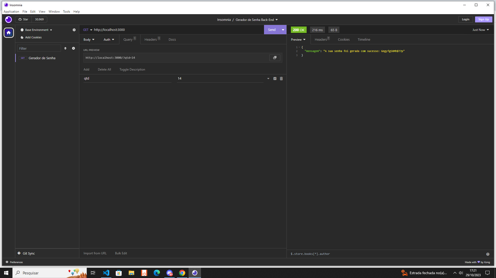

<h1>

</h1>

## Sobre

Este é um projeto feito para criação de senhas fortes de forma simples utilizando apenas javascript e os conceitos de back-end,rotas,middleware,json.

## Como Usar

insira http://localhost:3000/?qtd= e informe a quantidade de caracteres desejados na senha, o backend devolvera uma senha aleatorio usando letras numeros e caracteres especiais.

## Requisitos

express,nodejs

## prints

Requisição com insomnia -----

Mensagem de erro para requisiçoes incorretas no insomnia-----

Requisicao no navegador-----

